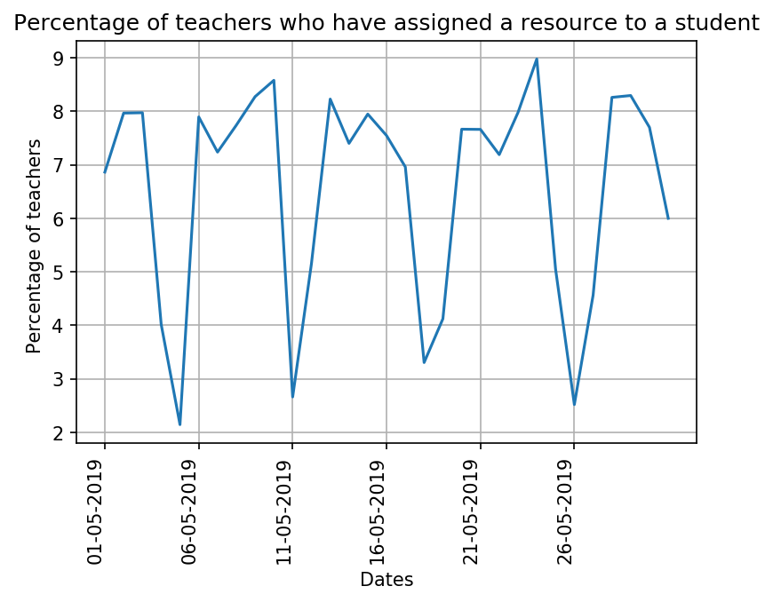

# Analysis of Instructors using Discover feature on Ed.

The following document provides a monthly report on the "Discover" feature usage by the teachers. This report details the number of teachers that launch a resource through discover ,the number of teachers who add a resource to a plan through discover, the number of teachers who assign any resource to a student(s) from the discover page (not using plans) and the number of idle teachers on the Ed platform. Idle numbers have been fetched as those who have logged on to Ed and haven't navigated to any part of Ed or opened up a resource to perform a task. All the data below has been fetched for the previous month.

## 1\. This graph below shows the percentage of non-working teachers in Ed. Non working teachers are those who just have one login event associated with their userid, i.e they have logged in to the Ed but haven't worked on Ed anymore.


```
          date  count_all  count_working  count_non_working  perc_non_working
0   01-05-2019       4108           3804                304          7.400195
1   02-05-2019       4129           3818                311          7.532090
2   03-05-2019       3210           2897                313          9.750779
3   04-05-2019        473            333                140         29.598309
4   05-05-2019        700            654                 46          6.571429
5   06-05-2019       4331           4141                190          4.386978
6   07-05-2019       4172           3870                302          7.238734
7   08-05-2019       4017           3719                298          7.418471
8   09-05-2019       3903           3612                291          7.455803
9   10-05-2019       3193           2881                312          9.771375
10  11-05-2019        451            312                139         30.820399
11  12-05-2019        563            524                 39          6.927176
12  13-05-2019       4362           4182                180          4.126547
13  14-05-2019       4215           3917                298          7.069988
14  15-05-2019       3711           3412                299          8.057127
15  16-05-2019       3511           3252                259          7.376816
16  17-05-2019       2830           2602                228          8.056537
17  18-05-2019        454            333                121         26.651982
18  19-05-2019        558            520                 38          6.810036
19  20-05-2019       3613           3456                157          4.345419
20  21-05-2019       3693           3426                267          7.229894
21  22-05-2019       3087           2863                224          7.256236
22  23-05-2019       2895           2645                250          8.635579
23  24-05-2019       1882           1657                225         11.955367
24  25-05-2019        297            224                 73         24.579125
25  26-05-2019        278            246                 32         11.510791
26  27-05-2019        657            617                 40          6.088280
27  28-05-2019       2905           2781                124          4.268503
28  29-05-2019       2953           2717                236          7.991873
29  30-05-2019       2480           2294                186          7.500000
30  31-05-2019       1800           1609                191         10.611111
```

## 2\. The graph below displays the percentage of teachers in Ed who have launced a resource using discover (not from plans)


```
          date  count_all  count_cardlaunch  perc_card_launch
0   01-05-2019       4108              2290         55.744888
1   02-05-2019       4129              2320         56.187939
2   03-05-2019       3210              1762         54.890966
3   04-05-2019        473               233         49.260042
4   05-05-2019        700               442         63.142857
5   06-05-2019       4331              2604         60.124683
6   07-05-2019       4172              2419         57.981783
7   08-05-2019       4017              2295         57.132188
8   09-05-2019       3903              2205         56.495004
9   10-05-2019       3193              1837         57.532101
10  11-05-2019        451               204         45.232816
11  12-05-2019        563               355         63.055062
12  13-05-2019       4362              2604         59.697387
13  14-05-2019       4215              2400         56.939502
14  15-05-2019       3711              2088         56.265158
15  16-05-2019       3511              1913         54.485901
16  17-05-2019       2830              1551         54.805654
17  18-05-2019        454               206         45.374449
18  19-05-2019        558               367         65.770609
19  20-05-2019       3613              2127         58.870745
20  21-05-2019       3693              2145         58.082859
21  22-05-2019       3087              1702         55.134435
22  23-05-2019       2895              1558         53.816926
23  24-05-2019       1882               958         50.903294
24  25-05-2019        297               148         49.831650
25  26-05-2019        278               153         55.035971
26  27-05-2019        657               423         64.383562
27  28-05-2019       2905              1678         57.762478
28  29-05-2019       2953              1646         55.739925
29  30-05-2019       2480              1362         54.919355
30  31-05-2019       1800               956         53.111111
```

## 3\. The graph below shows the percentage of teachers in Ed who have assigned a resource to a student(s) using discover (not from plans)



```
          date  count_all  count_assign  perc_disc_assign
0   01-05-2019       4108           282          6.864654
1   02-05-2019       4129           329          7.968031
2   03-05-2019       3210           256          7.975078
3   04-05-2019        473            19          4.016913
4   05-05-2019        700            15          2.142857
5   06-05-2019       4331           342          7.896560
6   07-05-2019       4172           302          7.238734
7   08-05-2019       4017           311          7.742096
8   09-05-2019       3903           323          8.275685
9   10-05-2019       3193           274          8.581272
10  11-05-2019        451            12          2.660754
11  12-05-2019        563            29          5.150977
12  13-05-2019       4362           359          8.230170
13  14-05-2019       4215           312          7.402135
14  15-05-2019       3711           295          7.949340
15  16-05-2019       3511           265          7.547707
16  17-05-2019       2830           197          6.961131
17  18-05-2019        454            15          3.303965
18  19-05-2019        558            23          4.121864
19  20-05-2019       3613           277          7.666759
20  21-05-2019       3693           283          7.663146
21  22-05-2019       3087           222          7.191448
22  23-05-2019       2895           231          7.979275
23  24-05-2019       1882           169          8.979809
24  25-05-2019        297            15          5.050505
25  26-05-2019        278             7          2.517986
26  27-05-2019        657            30          4.566210
27  28-05-2019       2905           240          8.261618
28  29-05-2019       2953           245          8.296647
29  30-05-2019       2480           191          7.701613
30  31-05-2019       1800           108          6.000000
```

## 4\. The graph below shows the percentage of teachers in Ed who have added a resource using discover to plans.


```
          date  count_all  count_addtoplan  perc_disc_add_to_plans
0   01-05-2019       4108               49                1.192795
1   02-05-2019       4129               59                1.428917
2   03-05-2019       3210               50                1.557632
3   04-05-2019        473                8                1.691332
4   05-05-2019        700               12                1.714286
5   06-05-2019       4331               51                1.177557
6   07-05-2019       4172               63                1.510067
7   08-05-2019       4017               46                1.145133
8   09-05-2019       3903               60                1.537279
9   10-05-2019       3193               60                1.879111
10  11-05-2019        451                9                1.995565
11  12-05-2019        563               13                2.309059
12  13-05-2019       4362               50                1.146263
13  14-05-2019       4215               45                1.067616
14  15-05-2019       3711               53                1.428186
15  16-05-2019       3511               49                1.395614
16  17-05-2019       2830               51                1.802120
17  18-05-2019        454                7                1.541850
18  19-05-2019        558               11                1.971326
19  20-05-2019       3613               50                1.383892
20  21-05-2019       3693               76                2.057947
21  22-05-2019       3087               71                2.299968
22  23-05-2019       2895               69                2.383420
23  24-05-2019       1882               55                2.922423
24  25-05-2019        297                8                2.693603
25  26-05-2019        278                4                1.438849
26  27-05-2019        657               35                5.327245
27  28-05-2019       2905               98                3.373494
28  29-05-2019       2953              152                5.147308
29  30-05-2019       2480              100                4.032258
30  31-05-2019       1800               50                2.777778
```
