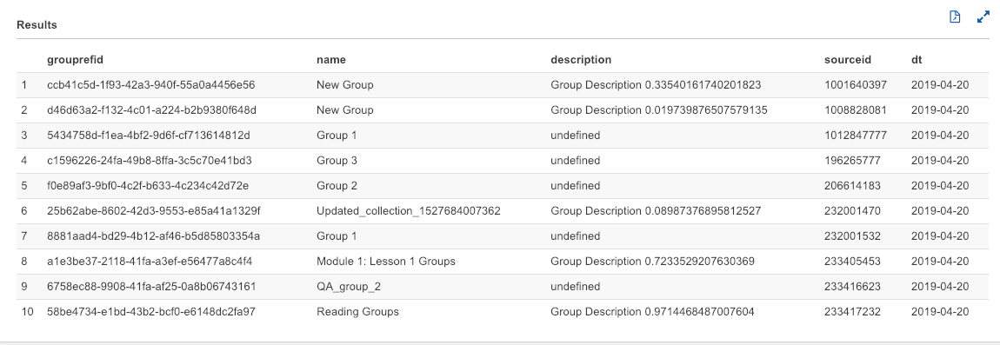
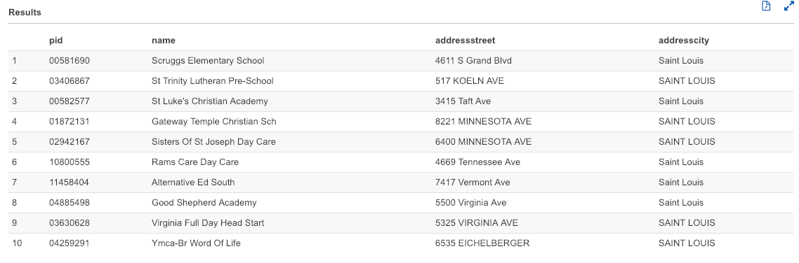
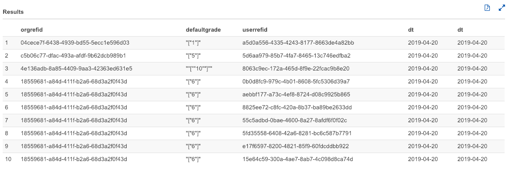
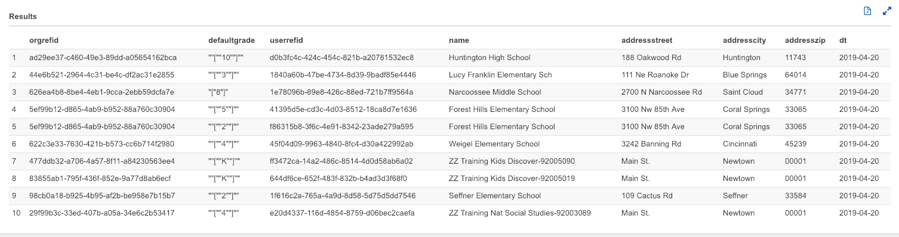
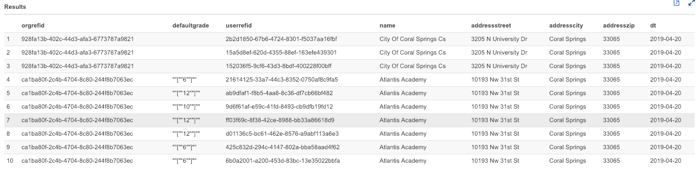

# Data Dictionary for Identity Data Source tables.

#### Terms used:
- User :- Any person utilising the Ed platform who is uniquely identifiable using the userrefid.
- Group :- A wrapper under which multiple students from a section can be grouped together for a specific task.
- Parent Group :- A group which contains multiple groups which are bound together using a single parent group ref id.
- Sub Group :- The groups which are created within a parent group using the parent group ref id.
- Section :- A class is a collection of students attending a particular course at the school. A section can contain multiple students and groups.
- School :- An organization for instructing students in a particular medium. It contains students, teachers and section. A school admin is the administrative head for ED with the capability to add new students and teachers.
- District:- A learning district is an organization with a collection of schools. A district admin would be the head of this organization with the ability to add new schools and teachers to the district.
- node :- A point on a graph which represents different entities like a user, a section etc in the IDS data store.
- edge :- A relationship between two point / nodes on a graph which represents a relation between different entities like a user to a group, a section to an organization etc in the IDS data store.
- sourceid :- The node table in the IDS lists out all the entities like user, org, section, groups etc. Each of these entities are referenced via the "id" field in the node table, which is called sourceid, a unique identifier using which a particular entity detail can be fetched.
- edgesourceid :- All the relationships that exists between different entities in the IDS is mapped in the edge table. The "id" column in the edge table is called the edgesourceid, a unique identifier using which a particular relationship details can be fetched.

## Data Dictionary details : -

The following tables provide a detailed description of different fields used in the IDS tables present in AWS Athena.

### IDS_GROUPS

This table details out all the groups present in the IDS. Groups are formed by adding some students to the groups via the UI. An empty group can also be created so that students can be added later on. Groups would be created under a larger group called a parent group.

| 	Data Point Name/Column Head	&nbsp;&nbsp;| Data Type | Constraint|	Description    &nbsp;&nbsp;&nbsp;&nbsp;&nbsp;&nbsp;&nbsp;&nbsp;&nbsp;&nbsp;&nbsp;&nbsp;&nbsp;     	| 	Example values	|
| :------------- | :------------------------------------- | :------------- | :------------- | :------------- |
|grouprefid | String | 36 char |  A universal unique reference identifier for the group using which a particular group can be identified in any table. This grouprefid is used as  a reference to create a relationship between a group -> user / group -> group / group -> section and vice versa. |   5e176242-e178-435e-9acc-2e72f3bf7163 |
|name        | String | undefined |  Name of the Group created by the user. For a parent group the description provided during the group creation would be the name for the group. The name of the sub groups would be the title provided during the group creation.  | ED: Training |
|description | String | undefined |  Description regarding the purpose of the group. Through the UI a user is not able to enter a description for the groups. The description for the parent group would be a random value provides using a random function from the UI and the description for subgroups is  "undefined".   | Group Description 0.6689411860385013 |
|sourceid | String | 10 char |  The node id for the given group through which the group can be easily identified in the Identity data store. The sourceid is the "id" value in the node table, the "node_id" value in the property table and the "fromId" / "toId" in the edge table of the IDS.  | 164649551 |
|dt | String | 10 char  |  Table partition maintained in AWS S3 based on date (YYYY-MM-DD)  | 2019-03-10 |

### IDS_GROUPS_SUBGROUPS :-

This table details out all the groups and their respective subgroups present in the IDS. Groups would be created under a larger group called a parent group.

| 	Data Point Name/Column Head	&nbsp;&nbsp;| Data Type | Constraint|	Description    &nbsp;&nbsp;&nbsp;&nbsp;&nbsp;&nbsp;&nbsp;&nbsp;&nbsp;&nbsp;&nbsp;&nbsp;&nbsp;     	| 	Example values	|
| :------------- | :------------------------------------- | :------------- | :------------- | :------------- |
|grouprefid |String | 36 char  |  A universal unique reference identifier for the group using which a particular group can be identified in any table. This grouprefid is used as  a reference to create a relationship between a group -> user / group -> group / group -> section and vice versa.  |   b865486b-2614-480e-9ff5-c6066a5e8b06	 |
|parentgrouprefid | String | 36 char |  grouprefid that can be used to uniquely identify a parent group in the groups list  | bf46b1f8-c2ed-4b65-a91e-712c1e71d749	 |
|parentgroupname | String | undefined |  Name of the associated parent group that is provided from the UI   | New Group |
|dt | String | 10 char |  Table partition maintained in AWS S3 based on date (YYYY-MM-DD)  | 2019-03-10 |

### IDS_GROUPS_SUBGROUPS_HISTORY

This table details out all the groups and their respective subgroups present in the IDS. It is also a history table which provides details about all the subgroups that were part of a group and removed from that group.

| 	Data Point Name/Column Head	&nbsp;&nbsp;| Data Type | Constraint|	Description    &nbsp;&nbsp;&nbsp;&nbsp;&nbsp;&nbsp;&nbsp;&nbsp;&nbsp;&nbsp;&nbsp;&nbsp;&nbsp;     	| 	Example values	|
| :------------- | :------------------------------------- | :------------- | :------------- | :------------- |
| grouprefid  | String | 36 char | A universal unique reference identifier for the group using which a particular group can be identified in any table. This grouprefid is used as  a reference to create a relationship between a group -> user / group -> group / group -> section and vice versa.  |   a8551976-3e68-402d-8bda-b46bf7412b36								 |
| sourceid            	| String | 10 char | The node id for the given group through which the group can be easily identified in the Identity data store indentifiable in the form of a graph. This id can be used in the node table to fetch group details as well as in the property table to fetch properties of the node(group). | 1000810225 |               	                    
| parentgrouprefid    	| String | 36 char | grouprefid that can be used to uniquely identify a parent group in the groups list | eff7aecd-6d79-4f1a-9869-8a4ae29ba7ab |
| parentgroupname     	| String | undefined | Name of the associated parent group that is provided from the UI | New Group |
| parentsourceid      	| String | 10 char | The node id for the given parent group through which the parent group can be easily identified as a group in the Identity data store identifiable when represented in the form of a graph. This id can be used in the node table to fetch group details as well as in the property table to fetch properties of the node(group). | 1000810224 |
| start               	| String | 24 char | Timestamp of subgroup creation under a parent group i.e. the time when the relationship started to exist between the two groups. | 2019-04-11T12:39:20.540Z |
| end                 	| String | 24 char | Timestamp of subgroup deletion under a parent group i.e. the time when the relationship ceases to exist between the two groups. |   |
| edgesourceid        	| String | 10 char | The id which can be used to fetch the relationship details between the two groups. This field can be used as the "id" field in the edge table in IDS which then provides the relation details between the parent and sub group. | 250701543 |
| dt                  	| String | 36 char | Table partition maintained in AWS S3 based on date (YYYY-MM-DD) | 2019-04-27 |

### IDS_GROUPS_USERS :-

This table details out all the users in different groups present in the IDS.

| 	Data Point Name/Column Head	&nbsp;&nbsp;| Data Type | Constraint|	Description    &nbsp;&nbsp;&nbsp;&nbsp;&nbsp;&nbsp;&nbsp;&nbsp;&nbsp;&nbsp;&nbsp;&nbsp;&nbsp;     	| 	Example values	|
| :------------- | :------------------------------------- | :------------- | :------------- | :------------- |
| grouprefid  | String | 36 char | A universal unique reference identifier for the group using which a particular group can be identified in any table. This grouprefid is used as  a reference to create a relationship between a group -> user / group -> group / group -> section and vice versa.  |   085d675e-75bc-4319-b3c8-5984292ff107	 |
| userrefid   | String | 36 char | reference id using which a user is uniquely identifiable. | e8fedb7f-c918-4c78-8be1-cfed61da0f3a	 |
| dt          | String | 10 char | Table partition maintained in AWS S3 based on date (YYYY-MM-DD) | 2019-03-23 |

### IDS_GROUPS_USERS_HISTORY : -

This table details out all the users present in groups in the IDS. It is also a history table which provides details about all the users that were part of a group and removed from that group.

| 	Data Point Name/Column Head	&nbsp;&nbsp;| Data Type | Constraint|	Description    &nbsp;&nbsp;&nbsp;&nbsp;&nbsp;&nbsp;&nbsp;&nbsp;&nbsp;&nbsp;&nbsp;&nbsp;&nbsp;     	| 	Example values	|
| :------------- | :------------------------------------- | :------------- | :------------- | :------------- |
| grouprefid      |String | 36 char | A universal unique reference identifier for the group using which a particular group can be identified in any table. This grouprefid is used as  a reference to create a relationship between a group -> user / group -> group / group -> section and vice versa.  |   b8ffbf8c-345a-4f03-a141-e7133bcfe8dc				 |
| userrefid       | String | 36 char | Reference id using which a user is uniquely identifiable.  | 73d6b196-6716-4b02-8b46-4ebf02842061	 |
| start           | String | 24 char | Timestamp of user addition to a group i.e. the time when the relationship started to exist between the user and the group. | 2018-08-30T03:08:53.046Z |
| end             | String | 24 char | Timestamp of user deletion under a group i.e. the time when the relationship ceases to exist between the user and the group. |         |
| groupsourceid   | String | 10 char | The node id for the given group through which the group can be easily identified as a group in the Identity data store when represented in the form of a graph. This id can be used in the node table to fetch group details as well as in the property table to fetch properties of the node(group). | 369818962	 |
| edgesourceid    | String | 10 char | The id which can be used to fetch the relationship details between the group and the user in a graph. This field can be used as the "id" field in the edge table in IDS which then provides the relation details between the user and the group. | 163711335 |
| usersourceid    | String | 10 char | The node id for the given user through which the user can be easily identified as a person in the Identity data store when represented in the form of a graph. This id can be used in the node table to fetch user details as well as in the property table to fetch properties of the node( user ) and in the edge table to find out associated relational edges. | 100401769 |
| dt              | String | 10 char | Table partition maintained in AWS S3 based on date (YYYY-MM-DD) | 2019-04-27 |

###  IDS_ORGANIZATIONS : -

This table provides details regarding all the organizations present in the IDS. Organizations include schools and learning districts.

| 	Data Point Name/Column Head	&nbsp;&nbsp;| Data Type | Constraint|	Description    &nbsp;&nbsp;&nbsp;&nbsp;&nbsp;&nbsp;&nbsp;&nbsp;&nbsp;&nbsp;&nbsp;&nbsp;&nbsp;     	| 	Example values	|
| :------------- | :------------------------------------- | :------------- | :------------- | :------------- |
| orgrefid      | String | 36 char | A universal unique reference identifier for the organization using which a particular organization can be identified in any table. This orgrefid is used as  a reference to create a relationship between an org -> section / org -> district etc vice versa.  |   4900b370-5fd6-4156-b3f6-dab0fb3619bf |		
| orgtype | String | 10 char | This field describe the type of organization as the organization could be one of school or district | school |
| pid	| String | 8 char | A permanent identifier created by MDR used to identify each organization uniquely.  | 01754149 |
| name	| String | undefined | Name of the organization  | Culbertson Mennonite School	 |
| addressstreet | String | undefined | Street address of the organization | 5992 Rowe Run Rd	 |
| addresscity	 | String | undefined| Organization city  | Chambersburg |
| addresszip	| String | 6 char | zipcode of the organization  | 17202 |
| sourceid	| String | 10 char | The node id for the given organization through which the organization can be easily identified as an entity in the Identity data store when represented in the form of a graph. This id can be used in the node table to fetch organization details and in the property table to fetch properties of the node( organization ) as well as in the edge table to find out associated relational edges.  | 100021 |
| dt 	| String | 10 char | Table partition maintained in AWS S3 based on date (YYYY-MM-DD) | 2019-04-15 |

### ids_organizations_parentorganizations

This table provides details regarding all the organizations  and their parent organizations present in the IDS. Parent Organizations include schools and learning districts.

| 	Data Point Name/Column Head	&nbsp;&nbsp;| Data Type | Constraint|	Description    &nbsp;&nbsp;&nbsp;&nbsp;&nbsp;&nbsp;&nbsp;&nbsp;&nbsp;&nbsp;&nbsp;&nbsp;&nbsp;     	| 	Example values	|
| :------------- | :------------------------------------- | :------------- | :------------- | :------------- |
| orgrefid | String | 36 char | A universal unique reference identifier for the organization using which a particular organization can be identified in any table. This orgrefid is used as  a reference to create a relationship between an org -> section / org -> district etc vice versa. | ea180b7d-3239-4f5f-887b-81f0fe933259 |
| orgtype | String | 10 char | This field describe the type of organization as the organization could be one of school or district  | school |
| parentorgrefid | String | 36 char | The orgrefid that is used to refer to the parent organization. It exists as an orgrefid in the ids_organizations table. | 32aca373-fb59-48cf-86c2-694b6f5028b2 |
| parentorgtype	 | String | 10 char | This field describe the type of parent organization for the organization which could be one of school or district  | district |
| parentname | String | undefined | Name of the parent organization | Rutland City Public Sch Dist |
| dt | String | 10 char | Table partition maintained in AWS S3 based on date (YYYY-MM-DD) | 2019-05-10 |

### IDS_ORGANIZATIONS_PARENTORGANIZATIONS_HISTORY : -

This table provides details regarding all the organizations  and their parent organizations present in the IDS. Parent Organizations include schools and learning districts. This is a history table so this would detail out historical status of the organizations as well as the current data.

| 	Data Point Name/Column Head	&nbsp;&nbsp;| Data Type | Constraint|	Description    &nbsp;&nbsp;&nbsp;&nbsp;&nbsp;&nbsp;&nbsp;&nbsp;&nbsp;&nbsp;&nbsp;&nbsp;&nbsp;     	| 	Example values	|
| :------------- | :------------------------------------- | :------------- | :------------- | :------------- |
| orgrefid | String | 36 char |  A universal unique reference identifier for the organization using which a particular organization can be identified in any table. This orgrefid is used as  a reference to create a relationship between an org -> section / org -> district etc vice versa. | 3f97c37a-bb17-4765-9a8b-96b12dc8dc44 |
| orgtype | String | 10 char | This field describe the type of the organization which could be one of school or district | school |
| parentorgrefid | String | 36 char | The orgrefid that is used to refer to the parent organization. It exists as an orgrefid in the ids_organizations table. | 4c82c823-fa3e-4fb8-820d-9f4d13faa2f5 |
| parentorgtype | String | 10 char | This field describe the type of parent organization for the organization which could be one of school or district | district |
| parentname | String | undefined | Name of the parent organization | Long Branch School District |
| sourceid | String | 10 char | The node id for the given organization, through which the organization can be easily identified in the Identity data store. The sourceid is the "id" value in the node table, the "node_id" value in the property table and the "fromId" / "toId" in the edge table of the IDS. | 87039 |
| edgesourceid | String | 10 char | The id which can be used to fetch the relationship details between the two organizations in the form of parent organization -> child organization. This field can be used as the "id" field in the edge table in IDS which then provides the relation details between the parent and child organization. | 1112836 |
| parentsourceid | String | 10 char | node id for the parent organization that can uniqely identify a parent organization as an organization in the node table. | 104789 |
| parentpid | String | 8 char | A permanent identifier created by MDR used to identify each parent organization uniquely. | 00691661 |
| start | String | 24 char | Start date for the parent -> child relationship i.e when one of the organization became the parent organization of the other. Example can be when a school is included under a learning district.  | 2017-03-22T10:03:12.396Z |
| end | String | 24 char | End date for the parent -> child relationship i.e when one of the organization ceases to relate to the parent organization. Example can be when a school is removed from a learning district. |  |
| dt | String | 10 char | Table partition maintained in AWS S3 based on date (YYYY-MM-DD) | 2019-05-07 |

### IDS_ORGANIZATIONS_SECTIONS : -

This table provides details regarding all the sections in different organizations present in the IDS.

| 	Data Point Name/Column Head	&nbsp;&nbsp;| Data Type | Constraint|	Description    &nbsp;&nbsp;&nbsp;&nbsp;&nbsp;&nbsp;&nbsp;&nbsp;&nbsp;&nbsp;&nbsp;&nbsp;&nbsp;     	| 	Example values	|
| :------------- | :------------------------------------- | :------------- | :------------- | :------------- |
| orgrefid | String | 36 char |  A universal unique reference identifier for the organization using which a particular organization can be identified in any table. This orgrefid is used as  a reference to create a relationship between an org -> section / org -> district etc vice versa. | 1	70db5ab3-1ae0-4100-baaa-36797c986ad3 |
| sectionrefid | String | 36 char | The node id for the given section through which the section can be easily identified in the Identity data store. The sourceid is the "id" value in the node table, the "node_id" value in the property table and the "fromId" / "toId" in the edge table of the IDS. | 61c689d2-e673-47cd-801b-af09171f7f44 |
| dt | String | 10 char | Table partition maintained in AWS S3 based on date (YYYY-MM-DD) | 2019-04-08 |

### IDS_ORGANIZATIONS_SECTIONS_HISTORY

This table provides details regarding all the sections in different organizations present in the IDS. This is a history table so this would detail out historical status of the sections as well as the current data.

| 	Data Point Name/Column Head	&nbsp;&nbsp;| Data Type | Constraint|	Description    &nbsp;&nbsp;&nbsp;&nbsp;&nbsp;&nbsp;&nbsp;&nbsp;&nbsp;&nbsp;&nbsp;&nbsp;&nbsp;     	| 	Example values	|
| :------------- | :------------------------------------- | :------------- | :------------- | :------------- |
| orgrefid | String | 36 char |  A universal unique reference identifier for the organization using which a particular organization can be identified in any table. This orgrefid is used as  a reference to create a relationship between an org -> section / org -> district etc vice versa. | 5291b565-bb6f-4334-91de-41550e1247c4 |
| sectionrefid | String | 36 char | A universal unique reference identifier for the section using which a particular section can be identified in any table. This sectionrefid is used as  a reference to create a relationship between an section -> Org / Section -> Group / Section -> User etc and vice versa. | 2b8606f7-0ec1-4a60-8a9e-254811d3f688 |
| sectionsourceid | String | 36 char | The node id for the given section through which the section can be easily identified in the Identity data store. The sourceid is the "id" value in the node table, the "node_id" value in the property table and the "fromId" / "toId" in the edge table of the IDS. | 278476573	 |
| sectionstart | String | 36 char | Date when the section was created in the organization | 2018-08-08T01:08:14.497Z |
| termsedgesourceid | String | 36 char | The id which can be used to fetch the relationship details between the a *term* and  *section*. This field can be used as the "id" field in the edge table in IDS which then provides the relation details between the *School term* and  *section*. | 115585208	 |
| termsstart | String | 36 char | Date when the "*School Term*" was created for a particular "*section*" |  2018-08-08T01:08:16.541Z  |
| termsend | String | 36 char | Date when the "*School Term*" ceased to exist for a particular "*Section*"  | 	 |
| termsourceid | String | 36 char | The node id for the given *Term* through which the School-term can be easily identified in the Identity data store. The sourceid is the "id" value in the node table, the "node_id" value in the property table and the "fromId" / "toId" in the edge table of the IDS. | 278253296	 |
| termstart | String | 36 char | Date when the "*School Term*" was added to the database | 2018-08-08T01:08:18.320Z	|
| schoolyearsedgesourceid | String | 36 char | The id which can be used to fetch the relationship details between the a *term* and  *School Year*. This field can be used as the "id" field in the edge table in IDS which then provides the relation details between the *School term* and  *section*. | 114780688 |
| schoolyearsstart | String | 36 char | School Year and term relation start date | 2018-08-08T01:08:21.916Z  |
| schoolyearsend | String | 36 char |  School Year and term end date. |  |
| schoolyearsourceid | String | 36 char | Id to reference the "SchoolYear" entity in the node table through which the school-year can be easily identified in the Identity data store. The sourceid is the "id" value in the node table, the "node_id" value in the property table and the "fromId" / "toId" in the edge table of the IDS. | 278253111 |
| schoolyearstart | String | 36 char |  | 2018-08-08T01:08:16.897Z		 |
| organizationofschoolyearedgesourceid | String | 36 char | Id to reference the "SchoolYear" -> "Organization" relationship in the edge table in IDS.  | 114780424 |
| organizationofschoolyearstart | String | 36 char | School year start date in the school (org)  | 2018-08-08T01:08:21.809Z			 |
| organizationofschoolyearend | String | 36 char | School year end date in the school (org) |  |
| organizationsourceid | String | 36 char | The node id for the given organization through which the organization can be easily identified in the Identity data store. The sourceid is the "id" value in the node table, the "node_id" value in the property table and the "fromId" / "toId" in the edge table of the IDS. | 112894 |
| organizationstart | String | 36 char | Date when the organization was added to the database | 2017-03-22T09:03:56.599Z	 |
| dt | String | 10 char | Table partition maintained in AWS S3 based on date (YYYY-MM-DD) | 2019-02-27 |

### IDS_ORGANIZATIONS_USERS : -

This table provides details regarding all the users in different organizations present in the IDS.

| 	Data Point Name/Column Head	&nbsp;&nbsp;| Data Type | Constraint|	Description    &nbsp;&nbsp;&nbsp;&nbsp;&nbsp;&nbsp;&nbsp;&nbsp;&nbsp;&nbsp;&nbsp;&nbsp;&nbsp;     	| 	Example values	|
| :------------- | :------------------------------------- | :------------- | :------------- | :------------- |
| orgrefid | String | 36 char |  A universal unique reference identifier for the organization using which a particular organization can be identified in any table. This orgrefid is used as  a reference to create a relationship between an org -> section / org -> district etc vice versa. | ff93793c-c796-4823-aa51-66c265339db5 |
| userrefid | String | 36 char | A universal unique reference identifier for the user using which a particular user can be identified in any table. This userrefid is used as  a reference to create a relationship between a user -> section / user -> group etc and vice versa. | 30e68bbb-6b74-4020-8ba6-3e71d509f596 |
| type | String | 36 char | Type of the user connected to the organization (student / Instructors/ School Admin / District Admin) | students |
| startdate | String | 36 char | Date when the user was added to the organization | 2019-04-11T05:15:52.461Z |
| dt | String | 10 char | Table partition maintained in AWS S3 based on date (YYYY-MM-DD) | 2019-04-15 |

### IDS_SECTIONS : -

This table provides details regarding all the sections present in the IDS.

| 	Data Point Name/Column Head	&nbsp;&nbsp;| Data Type | Constraint|	Description    &nbsp;&nbsp;&nbsp;&nbsp;&nbsp;&nbsp;&nbsp;&nbsp;&nbsp;&nbsp;&nbsp;&nbsp;&nbsp;     	| 	Example values	|
| :------------- | :------------------------------------- | :------------- | :------------- | :------------- |
| sectionrefid | String | 36 char | A universal unique reference identifier for the section using which a particular section can be identified in any table. This sectionrefid is used as  a reference to create a relationship between an section -> Org / Section -> Group / Section -> User etc and vice versa. | 41ef6d2a-b65f-4221-8cfa-837a10e63e65 |
| sourceid	 | String | 36 char | The node id for the given group through which the section can be easily identified in the Identity data store. The sourceid is the "id" value in the node table, the "node_id" value in the property table and the "fromId" / "toId" in the edge table of the IDS. | 1000173654 |
| studentcount | String | 36 char | Number of students in the group | 1 |
| groupcount | String | 36 char | Number of sub groups within the group |  |
| dt | String | 10 char | Table partition maintained in AWS S3 based on date (YYYY-MM-DD) | 2019-05-02 |

### IDS_SECTIONS_GROUPS : -

This table provides details regarding all the groups in different sections present in the IDS.

| 	Data Point Name/Column Head	&nbsp;&nbsp;| Data Type | Constraint|	Description    &nbsp;&nbsp;&nbsp;&nbsp;&nbsp;&nbsp;&nbsp;&nbsp;&nbsp;&nbsp;&nbsp;&nbsp;&nbsp;     	| 	Example values	|
| :------------- | :------------------------------------- | :------------- | :------------- | :------------- |
| sectionrefid | String | 36 char | A universal unique reference identifier for the section using which a particular section can be identified in any table. This sectionrefid is used as  a reference to create a relationship between an section -> Org / Section -> Group / Section -> User etc and vice versa. | f2496c7c-c6ee-4e87-8717-16ed4388733f |
| grouprefid | String | 36 char | The node id for the given group through which the section can be easily identified in the Identity data store. The sourceid is the "id" value in the node table, the "node_id" value in the property table and the "fromId" / "toId" in the edge table of the IDS. | 5f1ccd5a-caa0-46bc-b2cb-6cb90bcec156	 |
| dt | String | 10 char | Table partition maintained in AWS S3 based on date (YYYY-MM-DD) | 2019-03-24 |

### IDS_SECTIONS_GROUPS_HISTORY : -

This table provides details regarding all the groups in different sections present in the IDS. This is a history table so this would detail out historical status of the groups as well as the current data.

| 	Data Point Name/Column Head	&nbsp;&nbsp;| Data Type | Constraint|	Description    &nbsp;&nbsp;&nbsp;&nbsp;&nbsp;&nbsp;&nbsp;&nbsp;&nbsp;&nbsp;&nbsp;&nbsp;&nbsp;     	| 	Example values	|
| :------------- | :------------------------------------- | :------------- | :------------- | :------------- |
| sectionrefid | String | 36 char | A universal unique reference identifier for the section using which a particular section can be identified in any table. This sectionrefid is used as  a reference to create a relationship between an section -> Org / Section -> Group / Section -> User etc and vice versa. | 185a1c13-c29a-446f-815f-3874661edcea |
| grouprefid | String | 36 char | A universal unique reference identifier for the group using which a particular group can be identified in any table. This grouprefid is used as  a reference to create a relationship between a group -> user / group -> group / group -> section and vice versa. | a512ed1b-c1d4-4713-a3c7-a5fe940100ea |
| start | String | 36 char | Date wehn the group was added into the section | 2018-08-07T01:08:52.489Z |
| sourceid | String | 36 char | The node id for the given group through which the section can be easily identified in the Identity data store. The sourceid is the "id" value in the node table, the "node_id" value in the property table and the "fromId" / "toId" in the edge table of the IDS. | 113370417 |
| end | String | 36 char | Date when the group ceased to exist within the section |  |
| dt | String | 10 char | Table partition maintained in AWS S3 based on date (YYYY-MM-DD) | 2019-02-22 |				

### IDS_SECTIONS_USERS : -

This table provides details regarding all the users in different sections present in the IDS. Users include students as well as teachers.

| 	Data Point Name/Column Head	&nbsp;&nbsp;| Data Type | Constraint|	Description    &nbsp;&nbsp;&nbsp;&nbsp;&nbsp;&nbsp;&nbsp;&nbsp;&nbsp;&nbsp;&nbsp;&nbsp;&nbsp;     	| 	Example values	|
| :------------- | :------------------------------------- | :------------- | :------------- | :------------- |
| sectionrefid | String | 36 char | A universal unique reference identifier for the section using which a particular section can be identified in any table. This sectionrefid is used as  a reference to create a relationship between an section -> Org / Section -> Group / Section -> User etc and vice versa. | f3b5ee95-62b5-4a49-8cb3-9235a23643f5 |
| userrefid | String | 36 char | A universal unique reference identifier for the user using which a particular user can be identified in any table. This userrefid is used as  a reference to create a relationship between a user -> section / user -> group etc and vice versa. | 1b1366d5-620a-478d-8b20-8266da4a6985		 |
| usertype | String || 10 char | Type of user referred here (Student / Instructor)  | students |
| dt | String | 10 char | Table partition maintained in AWS S3 based on date (YYYY-MM-DD) | 2019-04-15 |

### IDS_SECTIONS_USERS_HISTORY : -

This table provides details regarding all the users in different sections present in the IDS. Users include students as well as teachers. This is a history table so this would detail out historical status of the users in respective sections as well as the current data.

| 	Data Point Name/Column Head	&nbsp;&nbsp;| Data Type | Constraint|	Description    &nbsp;&nbsp;&nbsp;&nbsp;&nbsp;&nbsp;&nbsp;&nbsp;&nbsp;&nbsp;&nbsp;&nbsp;&nbsp;     	| 	Example values	|
| :------------- | :------------------------------------- | :------------- | :------------- | :------------- |
| sectionrefid | String | 36 char | A universal unique reference identifier for the section using which a particular section can be identified in any table. This sectionrefid is used as  a reference to create a relationship between a section -> Org / Section -> Group / Section -> User etc and vice versa. | b9d812f0-a01a-4ef3-8270-b0dcc73eeb3f |
| userrefid	| String | 36 char | A universal unique reference identifier for the user using which a particular user can be identified in any table. This userrefid is used as  a reference to create a relationship between a user -> section / user -> group etc and vice versa. | 08a4e034-5711-4da9-8362-68bd81771910 |
| start | String | 24 char | Date when the user was added to the section | 2018-08-07T11:08:04.950Z |
| end	| String | 24 char | Date when the user ceased to be part of the section |   |
| sectionsourceid	| String | 10 char | The node id for the given section through which it can be easily identified in the Identity data store. The sectionsourceid is the "id" value in the node table, the "node_id" value in the property table and the "fromId" / "toId" in the edge table of the IDS.  | 2642441 |
| edgesourceid	| String | 10 char | The id which can be used to fetch the relationship details between the a section and a user. This field can be used as the "id" field in the edge table in IDS which then provides the relation details between the parent and sub group. | 114379975 |
| usersourceid	| String | 10 char | The node id for the given group through which the user can be easily identified in the Identity data store. The sourceid is the "id" value in the node table, the "node_id" value in the property table and the "fromId" / "toId" in the edge table of the IDS. | 1000061 |
| usertype	| String | 10 char | Type of user referred here (Student / Instructor)  | students |
| dt | String | 10 char | Table partition maintained in AWS S3 based on date (YYYY-MM-DD) | 2019-04-09 |

### IDS_USERS : -

This table provides details regarding all the users present in the Identity Data Store. Users include School admins, District admins, students as well as teachers.

| 	Data Point Name/Column Head	&nbsp;&nbsp;| Data Type | Constraint|	Description    &nbsp;&nbsp;&nbsp;&nbsp;&nbsp;&nbsp;&nbsp;&nbsp;&nbsp;&nbsp;&nbsp;&nbsp;&nbsp;     	| 	Example values	|
| :------------- | :------------------------------------- | :------------- | :------------- | :------------- |
| userrefid	 | String | 36 char |  A universal unique reference identifier for the user using which a particular user can be identified in any table. This userrefid is used as  a reference to create a relationship between a user -> section / user -> group etc and vice versa. | 91c28801-a4cd-47a6-8337-173ce75c1e3d |
| defaultgrade	| String | 12 char | Grade into which the student was added | ""[""12""]"" |
| gender	| String | 1 char | Gender of the user (This data is deprecated / not collected ) |  |
| englishproficiency	| String | undefined | English proficiency level of the user (This data is deprecated / not collected ) |  |
| economicstatus	| String | undefined | Economic Status of the user (This data is deprecated / not collected ) |  |
| sourceid	| String | 10 char | The node id for the given group through which the user can be easily identified in the Identity data store. The sourceid is the "id" value in the node table, the "node_id" value in the property table and the "fromId" / "toId" in the edge table of the IDS. | 1000113 |
| dt | String | 10 char | Table partition maintained in AWS S3 based on date (YYYY-MM-DD) | 2019-04-06 |

### Example Queries in AWS Athena : -

#####  Following are some SQL queries that can be used in AWS Athena to understand the IDS tables in a better way.

1. Select all details regarding groups active on '2019-04-20' upto a maximum of 10 rows.

 <i>SELECT * FROM ids_groups where dt = '2019-04-20'  limit 10 ;

2. select pid, name, street address, city details of all the schools from zipcode 63111 active on '2019-04-20'.

 <i>SELECT pid, name, addressstreet,addresscity   FROM ids_organizations  
where orgtype = 'school' and addresszip = '63111'
and dt = '2019-04-20'  limit 10 ;

3. select orgrefid grade userid date of all organizations which are active on '2019-04-20'

<i>SELECT  distinct(org.orgrefid),
users.defaultgrade, users.userrefid, org.dt, users.dt
FROM ids_organizations_users org
JOIN ids_users users on org.userrefid = users.userrefid
where org.dt = '2019-04-20'
and users.dt = '2019-04-20'
limit 10 ;

4. select orgrefid grade userid pid, name, street address, city details and date of all organizations which are active on '2019-04-20'

 <i>SELECT  distinct(org.orgrefid),
users.defaultgrade, users.userrefid,
ids_org.name, ids_org.addressstreet, ids_org.addresscity, ids_org.addresszip, ids_org.dt
FROM ids_organizations_users org
JOIN ids_users users on org.userrefid = users.userrefid
JOIN ids_organizations ids_org on ids_org.orgrefid = org.orgrefid
where org.dt = '2019-04-20'
and users.dt = '2019-04-20'
and ids_org.dt = '2019-04-20'
limit 10 ;

5. select orgrefid grade userid pid, name, street address, city details and date of all organizations which are active on '2019-04-20' belonging to zipcode 33065

<i>SELECT  distinct(org.orgrefid),
users.defaultgrade, users.userrefid,
ids_org.name, ids_org.addressstreet, ids_org.addresscity, ids_org.addresszip, ids_org.dt
FROM ids_organizations_users org
JOIN ids_users users on org.userrefid = users.userrefid
JOIN ids_organizations ids_org on ids_org.orgrefid = org.orgrefid
where ids_org.addresszip = '33065'
and org.dt = '2019-04-20'
and users.dt = '2019-04-20'
and ids_org.dt = '2019-04-20'
limit 10 ;

